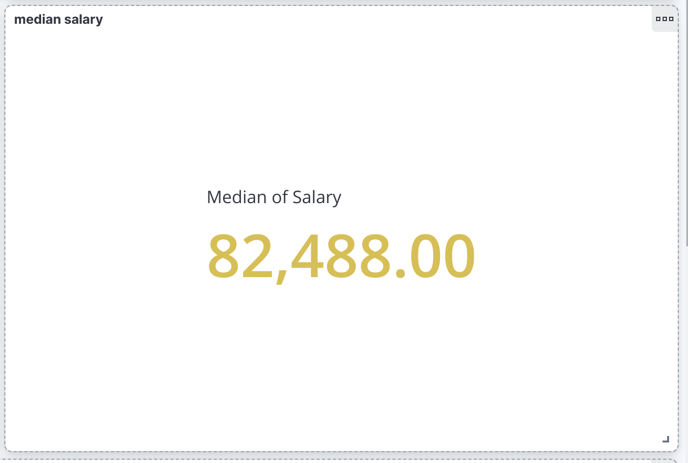
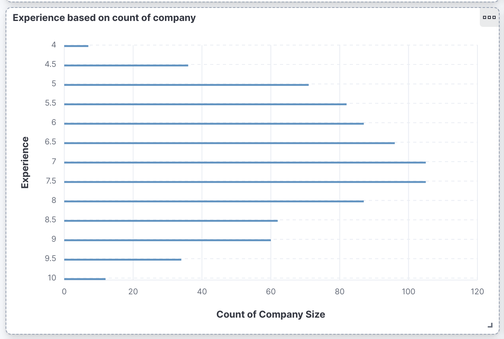
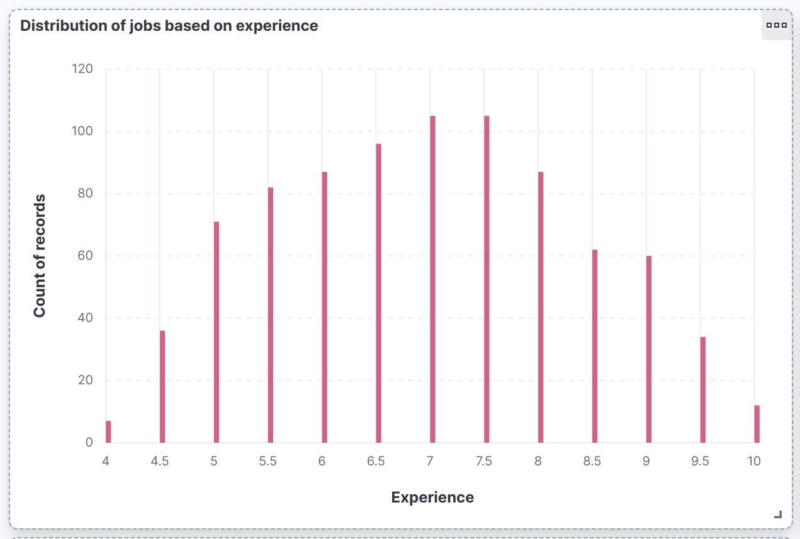
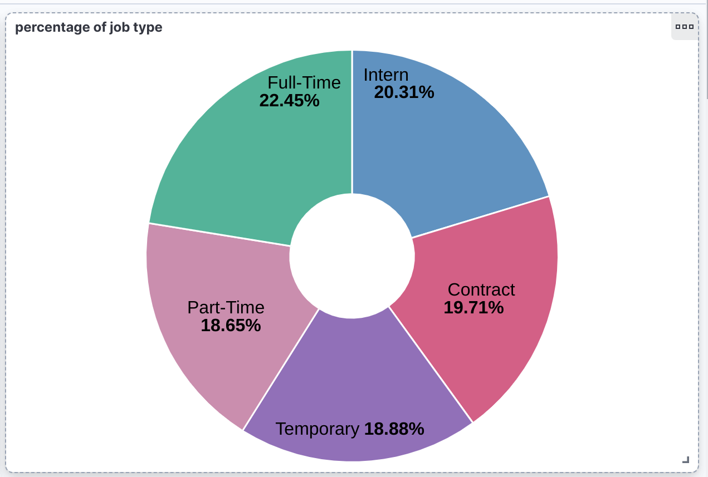

# Tap_project_jobs


## Project Description
This project was developed by **Carmelo Bertolami** for the **Technology for Advanced Programming** course at the **University of Catania**.

## Project Objective
The project aims to support job seekers who encounter job postings that do not specify the **Gross Annual Salary**. This issue is particularly prevalent in Italy, creating uncertainty and confusion among job seekers. However, knowing the compensation is crucial for making informed decisions and planning one's professional future.

My objective is to break the taboo around salary discussions, ensuring that people can access clear and transparent information regarding the salary associated with a job opportunity. This way, I aim to promote greater fairness and awareness in the job market, allowing individuals to evaluate job offers based on their needs and aspirations.

## Technologies Used

### Centralized Service:
- **[Zookeeper](https://zookeeper.apache.org/)**: Used as a centralized service for managing and coordinating nodes within the ecosystem.

### Data Ingestion:
- **[Fluentd](https://www.fluentd.org/)**: Responsible for collecting and sending data from various sources to the data streaming system.

### Data Streaming:
- **[Apache kafka](https://kafka.apache.org/)**: Used for data streaming, allowing the management and transmission of real-time data streams.
- **Spark Structured Streaming**: Integrated with Kafka to continuously process and analyze real-time data streams.

### Data Processing:
- **[Apache spark with sparkML](https://spark.apache.org/)**: Used for data processing and training machine learning models for predictions.

### Data Indexing:
- **[Elasticsearch](https://www.elastic.co/elasticsearch)** Used for efficiently indexing and storing data, facilitating search and analysis.

### Data Visualization:
- **[Kibana](https://www.elastic.co/kibana)**: Used for interactive visualization and dashboard creation to analyze data stored in Elasticsearch.

## Project Structure (Pipeline)


## How to Run Everything
Place Spark in the Kafka setup folder:
[Download Kafka](https://downloads.apache.org/kafka/3.7.0/kafka-3.7.0-src.tgz)

Place the files available at the following link inside the /archive/archive folder: [Download CSV](https://studentiunict-my.sharepoint.com/:f:/g/personal/brtcml02m30a638u_studium_unict_it/EpBgxkkaCYBNgsEJQPN_AWwBedfeMZilf1whm7nU6Vyvhw?e=Mv1Wed)

## Initial Setup
To start the program, follow these steps:
```bash
git clone git@github.com:tuppulix/Tap_project_jobs.git
```

Go to the folder: **Tap_project_jobs**
```bash
 docker network create --subnet=10.0.9.0/24 tap
```
```bash 
docker compose up -d --build
```

## to shutdown

```bash
docker compose down
```

## View the Results:
**KIBANA**: [http://10.0.9.31:5601/](http://10.0.9.31:5601/)






## Troubleshooting
In case of error in spark:

``` bash
docker compose up spark --build  
```

## Info
The project is still in its initial development phase. We're currently focusing on building the frontend portion, which will allow users to interact with the application. Additionally, we're planning to further optimize the machine learning model for better performance.

Every use for profit is illegal and prohibited.

C.B